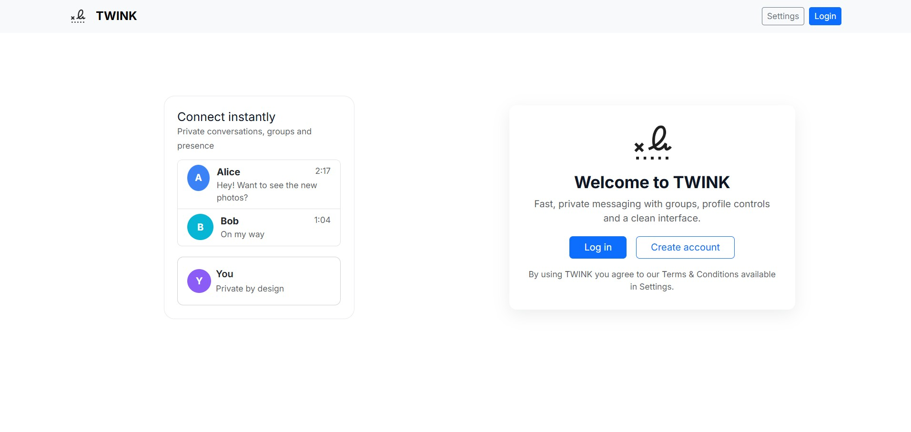
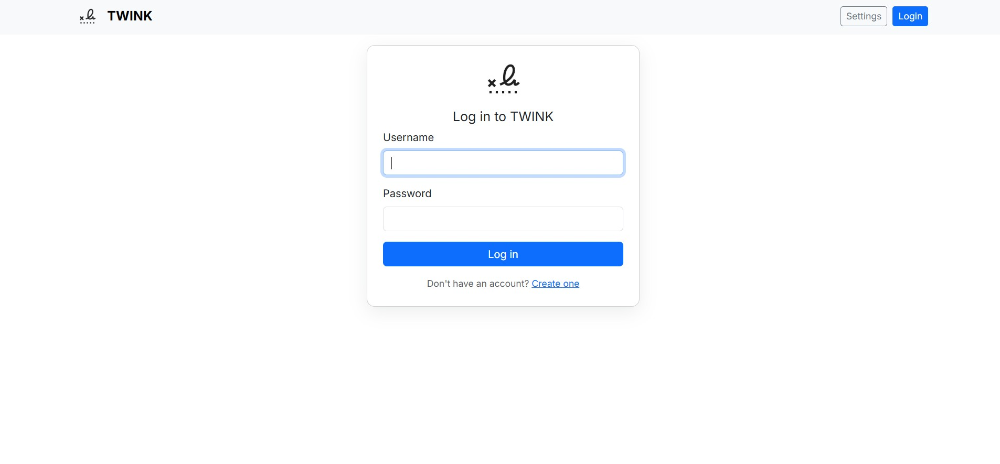
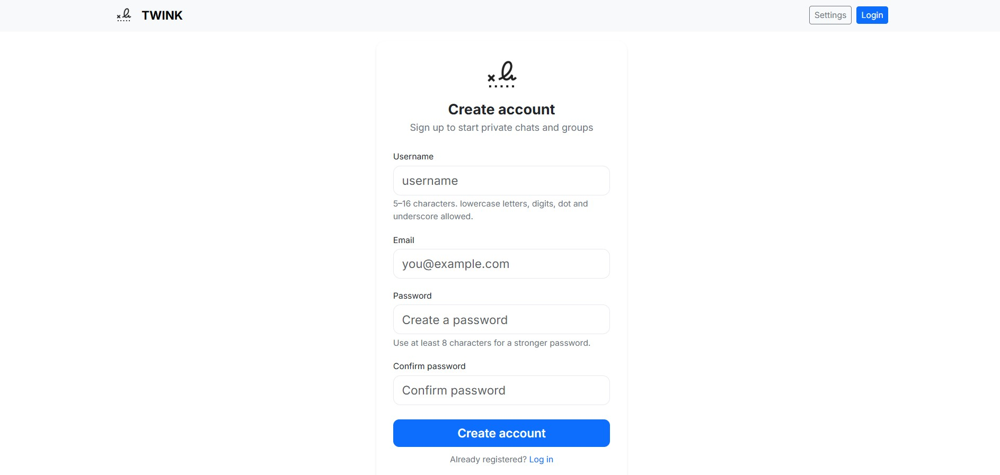
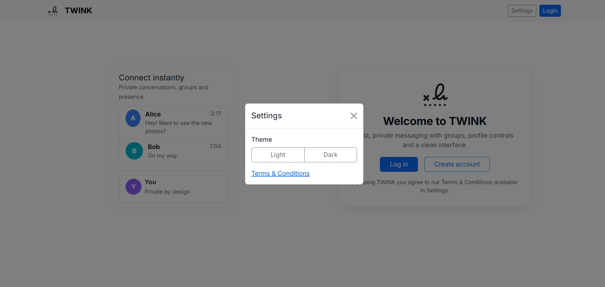
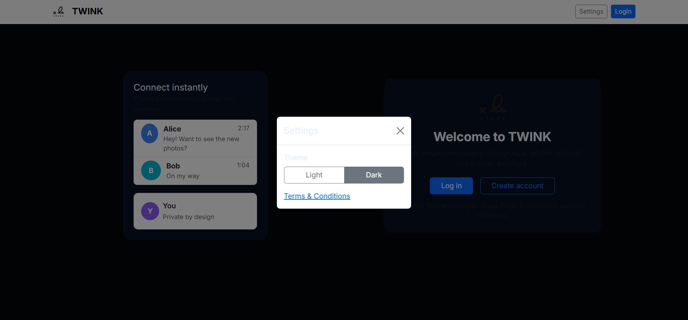
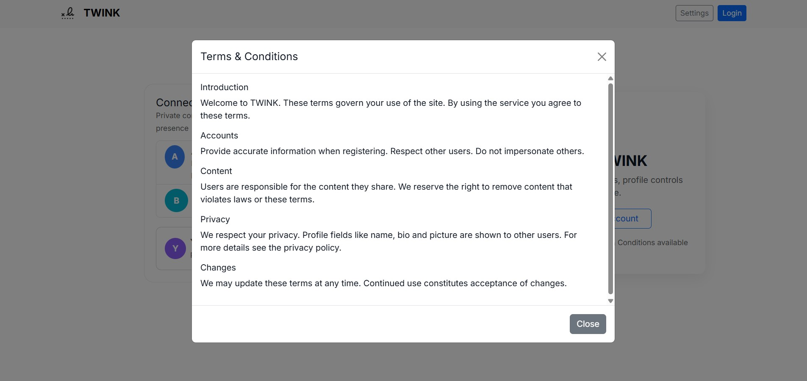
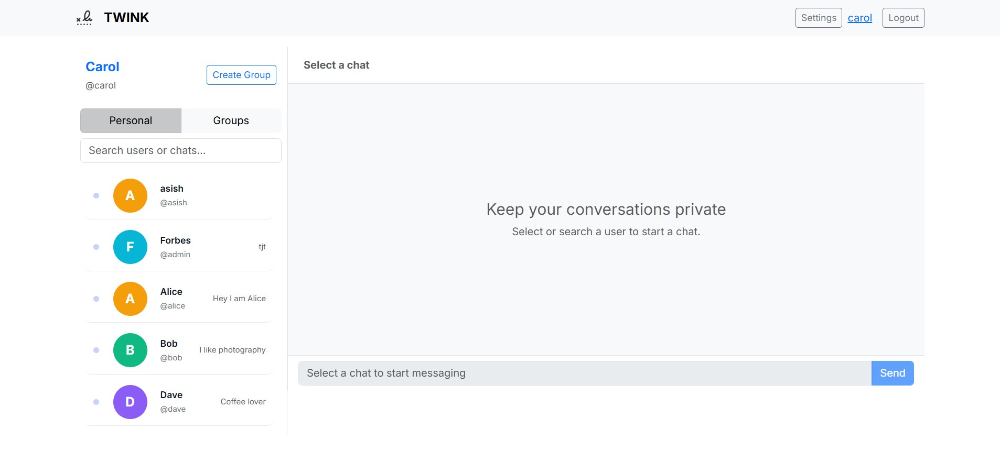
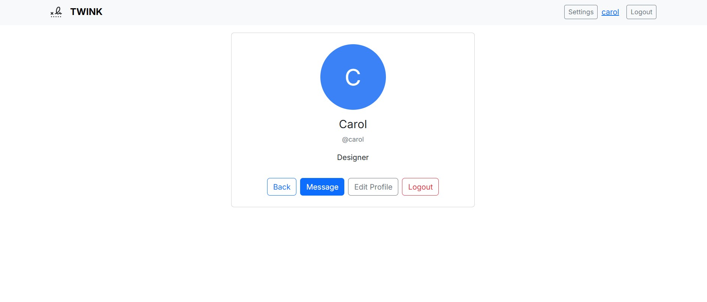
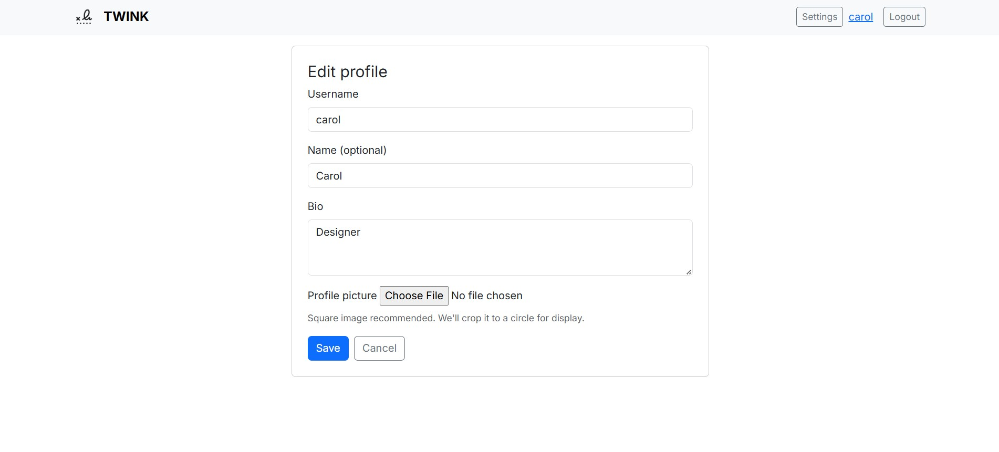

# TWINK — Realtime Chat App  

TWINK is a clean, minimal **Django + Channels** based real-time chat web app featuring:  
- User registration, login, and profile system  
- Personal and group chats  
- Light/Dark theme toggle  
- Modern Bootstrap 5 interface  
- Optional front-end **demo mode** (fake users, messages & groups)  
- Fully ready for local development and GitHub deployment  

---

## ⚙️ Features Overview

- **User system:** Register, login, profile picture & bio  
- **Chats:** 1-on-1 and group messaging  
- **UI:** Modern, Instagram-inspired chat interface with read receipts, timestamps & avatars  
- **Themes:** Light/Dark mode support across the entire app  
- **Demo mode:** Optional JavaScript demo injector for fake chat users & messages  
- **Responsive:** Works beautifully on desktop and mobile  

---

## 🖼️ Screenshots

Below are screenshots of key pages (place your images in `screenshots/`):

### Welcome Page


### Login Page


### Registration Page


### Settings






### Home Page


### Profile




---

## 🧠 Tech Stack

| Layer | Technology |
|-------|-------------|
| Backend | Django 5.x, Django Channels |
| Frontend | HTML, Bootstrap 5, CSS (custom theme), Vanilla JS |
| Database | SQLite (default) |
| Auth | Django built-in authentication |
| Deployment | GitHub + PythonAnywhere/Render ready |

---

## 🚀 Install & Run (Development) — Full Steps

### 1. Clone the repository

```bash
git clone https://github.com/<your-username>/TWINK.git
cd TWINK

### 2. Create & Activate Virtual Environment

On Windows (PowerShell):
    python -m venv venv
    venv\Scripts\activate
On macOS / Linux (bash):
    python -m venv venv
    source venv/bin/activate

### 3. Install Dependencies

If requirements.txt is present:
    pip install -r requirements.txt
If not:
    pip install Django==5.2.7 channels djangorestframework

### 4. Apply Database Migrations

python manage.py migrate

### 5. (Optional) Create a Superuser

python manage.py createsuperuser

### 6. Run Development Server

python manage.py runserver
Now visit:
    👉 http://127.0.0.1:8000/

---

## 📁 Project Structure (Important Files)

### TWINK/                            # project root
├─ chat/
│  ├─ templates/chat/              # HTML templates
│  │  ├─ base.html
│  │  ├─ welcome.html
│  │  ├─ login.html
│  │  ├─ register.html
│  │  ├─ home.html
│  │  ├─ profile.html
│  │  └─ view_profile.html
│  ├─ static/chat/                # Static files
│  │  ├─ css/twink.css
│  │  ├─ js/twink.js
│  │  └─ img/
│  │     ├─ logo.png
│  │     ├─ favicon-32.png
│  │     ├─ favicon-16.png
│  │     └─ favicon.ico
│  ├─ models.py                   # Chat, Group, Profile models
│  ├─ views.py                    # App views
│  └─ forms.py                    # Registration, profile forms
├─ TWINK_proj/                    # Project configuration
│  ├─ settings.py
│  └─ urls.py
├─ db.sqlite3                     # Default database
├─ requirements.txt
└─ README.md

---